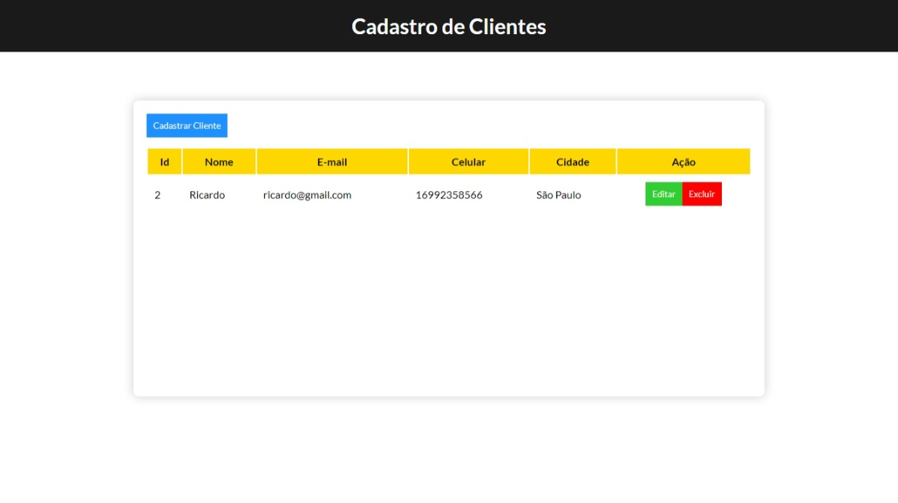

<h1 align=" center"> 
    CRUD Cadastro de Clientes JS 📚
</h1>

<h1>
    
</h1>

<h2 align="center">
    <a href="https://matheusnlourenco.github.io/projeto-js-crudCadastroClientes/">Ver projeto</a>
</h2>
<h2>🚨 Sobre </h2>

Projeto CRUD cadastro de clientes. Feito com js vanilla utilizando classes.

<h2>🔨 Ferramentas </h2>

- HTML
- CSS/SASS
- JAVASCRIPT
